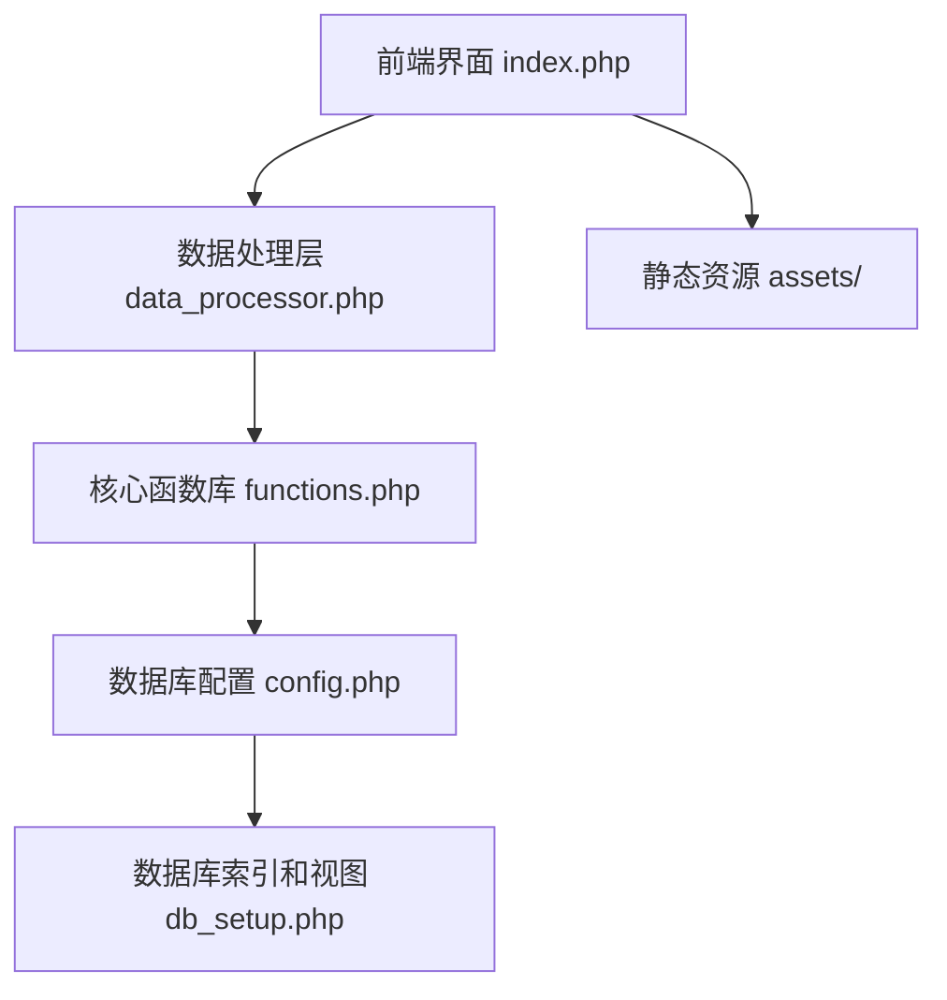

# 保险续保数据分析系统

一个专业的保险续保数据分析Web系统，提供实时数据可视化、续保率分析和业务员绩效跟踪等功能。

## 功能特性

- 📊 实时数据看板
- 📈 多维度统计图表
- 📉 续保率分析
- 👥 业务员绩效分析
- 🔄 数据自动同步
- ⚡ 高性能查询优化
- 🛡️ 完善的安全措施

## 系统架构



## 数据流转


## 技术栈

- 后端：PHP 7.0+
- 数据库：MySQL 5.7+
- Web服务器：Apache/Nginx
- 前端框架：
  - ECharts（数据可视化）
  - Font Awesome（图标库）
  - 响应式设计

## 主要功能模块

### 1. 数据展示
- 实时数据看板展示
- 多维度统计图表
- 续保率分析视图
- 业务员绩效跟踪

### 2. 数据分析
- 续保率计算（季度/月度/周度）
- 环比分析
- 同期对比
- 业务员贡献度分析

### 3. 数据管理
- 续保数据录入
- 数据更新和同步
- 异常数据标记和处理

## 数据库设计

### 主要表结构
1. 续保表(xubao)
   - 记录续保相关信息
   - 针对性能优化的索引设计

2. 原始数据表(yuanshiju)
   - 存储原始保单数据
   - 建立复合索引优化查询

### 性能优化
- 针对查询频繁字段建立索引
- 使用复合索引优化多字段查询
- 创建视图简化复杂查询
- 实现查询缓存机制

## 安装部署

### 环境要求
```
PHP >= 7.0
MySQL >= 5.7
Apache/Nginx Web服务器
```

### 安装步骤
1. 克隆项目到本地
```bash
git clone [项目地址]
```

2. 配置数据库
- 修改 `config.php` 中的数据库连接信息
- 运行 `db_setup.php` 创建必要的数据库结构

3. 配置Web服务器
- 将网站根目录指向项目目录
- 确保PHP环境正确配置

4. 访问测试
- 访问项目URL确认安装成功
- 检查数据看板是否正常显示

## 安全措施

- SQL注入防护
- XSS攻击防护
- 数据验证和过滤
- 敏感信息加密存储

## 性能优化

### 数据库优化
- 索引优化
- 查询缓存
- 复杂查询优化

### 前端优化
- 资源压缩
- 按需加载
- 缓存策略

## 计算逻辑

### 续保率计算
- 季度续保率统计
- 月度续保率分析
- 周续保率跟踪
- 考虑脱保天数影响

### 续保周期天数统计
- 记录已续保时间距离保险止期的天数
- 计算方法：保险止期日期 - 支付日期
- 示例：如果A车在xubao表中支付日期为2025-06-01，而在yuanshiju表中保险止期为2025-06-07，则A车被定义为"7日内续保"
- 根据天数差值分类：7日内、15日内、30日内等
- 用于分析客户续保行为模式和及时性

### 业务指标计算
- 总任务量统计
- 月任务量计算
- 续保量统计
- 环比数据分析

### 绩效计算
- 录单员绩效评估
- 业务员业绩统计
- 贡献值计算方法

## 目录结构

```
├── assets/            # 静态资源文件
├── config.php         # 配置文件
├── data_processor.php # 数据处理逻辑
├── db_setup.php      # 数据库设置
├── functions.php     # 核心函数库
└── index.php         # 主入口文件
```

## 维护与支持

- 定期数据库优化
- 性能监控和调优
- 安全漏洞修复
- 功能持续更新

## 注意事项

1. 首次部署需要正确配置数据库连接信息
2. 建议定期备份数据库
3. 需要定期检查并优化数据库索引
4. 建议配置错误日志监控

## 版权信息

© 2025  保险续保数据分析系统